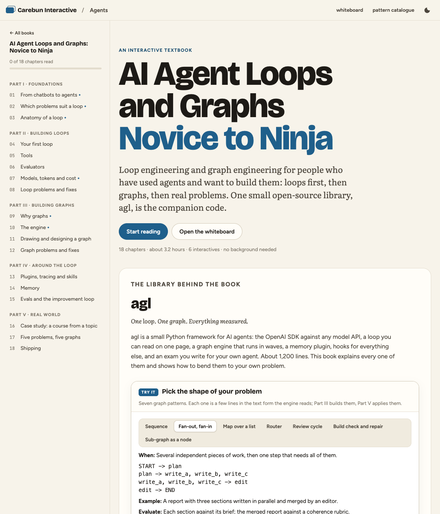
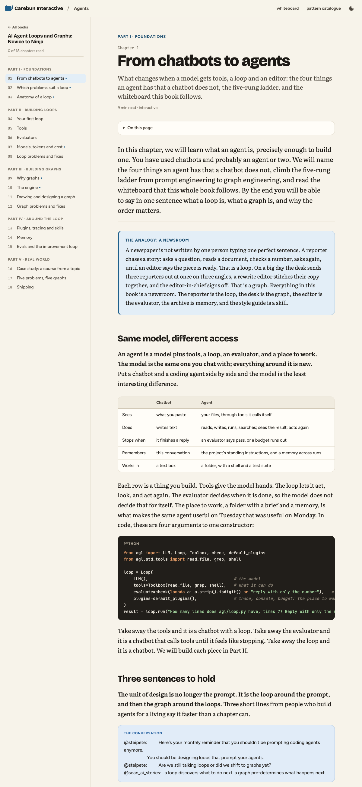
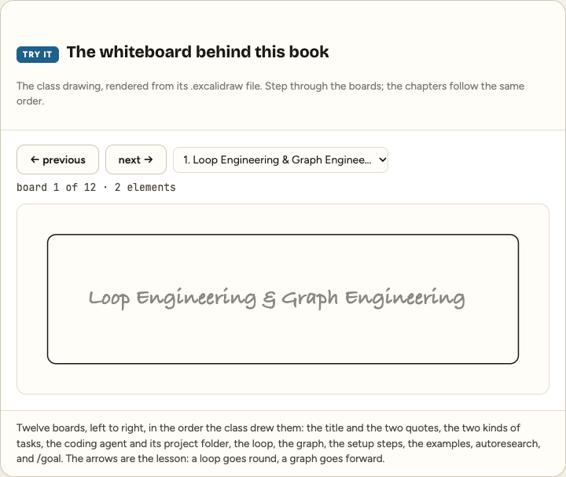
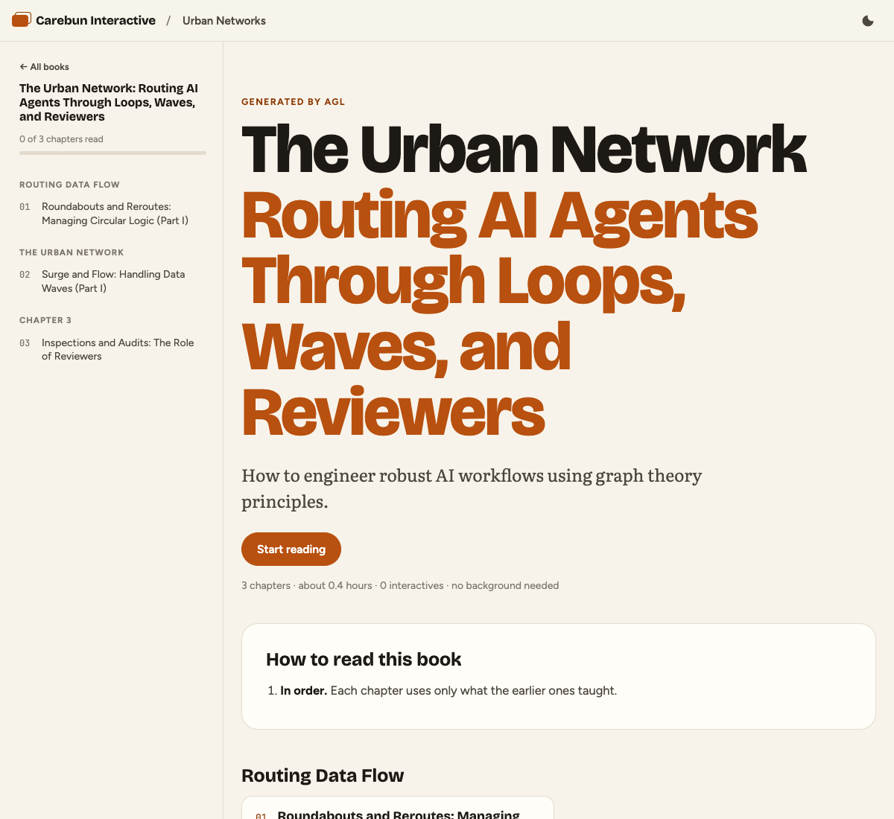
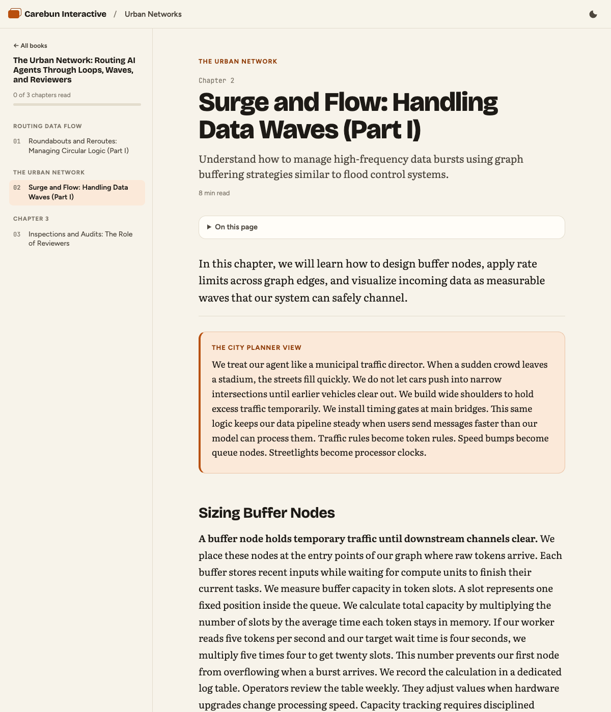
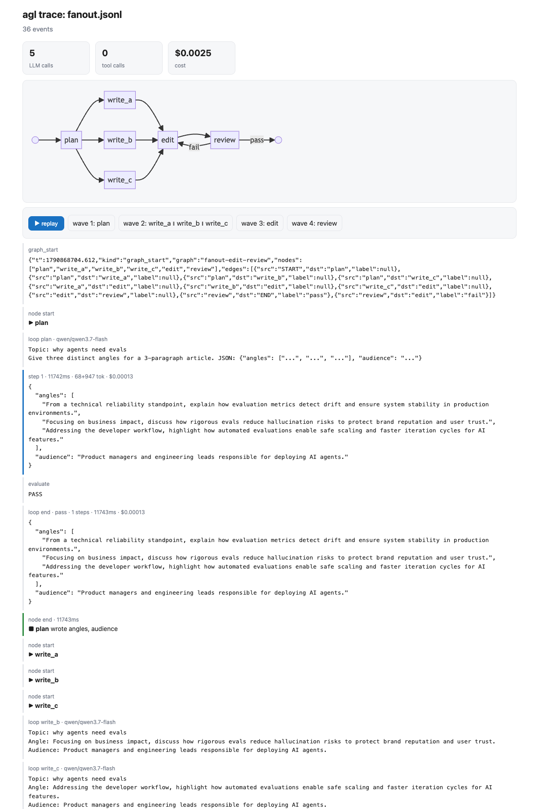

# agentic-graph-loop (`agl`)

Code: https://github.com/madhudream/agl · Book: https://interactive.carebun.com/agents/

A small, legible agent framework for **loop engineering** and **graph engineering**, built on the OpenAI
SDK against any OpenAI-compatible model API, with mem lib (a small built-in memory library behind a pluggable backend interface) as long-term memory, everything-is-a-plugin hooks,
skills as markdown pages, and a karpathy/autoresearch-style experiment loop (`CLAUDE.md`) that keeps
improving it. Written so a student can read all of it in an afternoon.

```
Loop                                              Graph
Prompt ─► LLM ─► Action ─► Result ─┐              Prompt ─► plan ─┬► loop A ─┐
          ▲                        ▼                              ├► loop B ─┼─► edit ─► review ─► Final
          └── Fail ◄── Evaluate ─► Pass ─► Final                  └► loop C ─┘     ▲        │ fail
                                                                                   └────────┘
```

> a loop discovers what to do next; a graph pre-determines what happens next.  (Sean Chen, AI Stories)
> you should be designing loops that prompt your agents.  (Peter Steinberger)

## Quick start

```bash
cd ~/apps/agentic-graph-loop
echo 'AGL_API_KEY=...' > .env                        # your model API key; AGL_BASE_URL for a non-default API
uv sync                                               # python 3.12, openai, pypdf
uv run pytest -q                                      # 21 offline tests, < 1 s
uv run python examples/loop_hello.py                  # the loop: tools + deterministic evaluate
uv run python examples/graph_fanout.py "why agents need evals"   # the graph: fan-out, edit, judge, router
uv run python examples/memory_loop.py                 # run twice: remember, then recall
uv run python examples/course_builder.py "Graph engineering for AI agents" --chapters 3   # topic → book folder
uv run python examples/triage.py "I was charged twice and the app crashes"   # router + specialists + policy check
uv run agl eval --desc "what I changed"               # the exam → results.tsv
uv run agl viz traces/run.jsonl --open                # replay a run in the browser
uv run agl draw examples/graph_fanout.py --excalidraw docs/fanout.excalidraw
```

Models are chosen by env: `AGL_MODEL` (the worker, default ChatGPT 5 mini), `AGL_MODEL_JUDGE` (the judge, default
ChatGPT 5), `AGL_MODEL_SMART` (the specialist, default ChatGPT Astra). `uv run agl models` lists what your model API
offers. The lab runs below used cheaper flash-class worker and judge models set in the lab's `.env`; every row names them
by role, and `results.tsv` has the exact ids.

## The library (agl/, about 1,100 lines)

| file | lines | what it is |
|---|---|---|
| `llm.py` | 230 | one `LLM.chat()` for everything: cost per call as the model API reports it, tokens, latency, retries, SQLite cache, process budget, `reasoning` knob |
| `tools.py` | 135 | `@tool`: a typed function becomes a tool schema from its signature and docstring. `Toolbox.call` never raises; errors go back to the model as text |
| `loop.py` | 240 | **the loop**. `Loop(llm, tools, evaluate, plugins).run(task)`. Evaluators: `check(fn)`, `judge(llm, rubric)`, `all_of(...)`. Parallel tool calls, structured output (`json_schema=`), `ToolDenied` for plugins that gate tools. `loop.as_node(prompt)` makes it a graph node |
| `graph.py` | 360 | **the graph**. Nodes are `fn(state) -> dict`. Waves run ready nodes in parallel and merge disjoint keys. Routers, back edges (DFS-detected), `Graph.from_text` DSL, `fanout` for run-time width, sub-graphs as nodes, `Node(retries=)`, `run(checkpoint=)` for resume, Mermaid and excalidraw export |
| `plugins.py` | 260 | hooks around the loop and the graph. `Trace` (JSONL), `Console`, `Budget`, `Compact` (context compaction), `Approval` (human in the loop: a guarded tool runs only if a policy says yes), `Skills` (`skills/*.md` → system prompt). `default_plugins()` is the standard preset, `Plugins()` the minimal one |
| `memory.py`, `memlib.py` | 230 | memory as a plugin (recall before, remember after) and as tools; `MemoryBackend` protocol; mem lib is the shipped backend (SQLite, dated facts, keyword search, one extraction call) |
| `std_tools.py` | 120 | calc, read_file, write_file, list_files, grep, shell, read_pdf; confined to `AGL_WORKDIR` |
| `eval.py` | 190 | the exam: `evals/tasks.jsonl`, deterministic checks then judge, autoresearch-style summary, `results.tsv` |
| `viz.py`, `cli.py` | 300 | excalidraw/mermaid export, HTML trace replay, the `agl` command |

Design rules: KISS and DRY. One client, one loop, one engine. A node is a function. A tool is a function.
A plugin is an object with hook methods. Everything else is built from those four.

## What was borrowed, and from where

- **The whiteboard** (`loop-engineering-and-graph-engineering.excalidraw`): measurable vs non-measurable tasks, the loop picture, the graph picture, the AI-coding-agent + CLAUDE.md framing, the autoresearch example.
- **Waku Agent** (Sean Chen): wave execution, disjoint-key merge, routers, "code you can read in an afternoon". `agl/graph.py` is our own engine with the same spirit plus a text DSL, back-edge detection and `fanout`.
- **karpathy/autoresearch**: `CLAUDE.md` is `program.md` for this repo; `results.tsv`; keep/discard; the simplicity criterion; "never stop".
- **Plugin harnesses**: everything around the loop is a plugin; presets (`default_plugins` = standard, `Plugins()` = minimal).
- **Claude Code / Codex**: `skills/*.md` as procedural memory, `CLAUDE.md` as the agent's job description, a confined shell tool, structured JSON replies with tolerant parsing.
- **Memory frameworks** (mem0 and others): the recall-before, remember-after shape. mem lib is the smallest thing that does it; the backend interface lets a bigger one in.

## The book: AI Agent Loops and Graphs, Novice to Ninja

`apps/interactive-copy/books/agents/` is an 18-chapter interactive textbook on loop engineering and graph
engineering, written for the interactive site in its own format and built around this library. It is for
people who have used agents and want to build them: foundations (what an agent is, which problems suit a
loop, the anatomy of a loop), building loops (a first loop, tools, evaluators, models and cost, loop problems
and fixes), building graphs (why graphs, the engine, drawing and designing, graph problems and fixes), around
the loop (plugins and tracing, memory, evals and the improvement loop), and the real world (a full case study,
five problems mapped to five graphs, shipping). Six interactives, including a widget that renders the class
whiteboard from its `.excalidraw` file and a pattern picker with the seven graph shapes in the text form the
engine reads. The book teaches techniques and the problems they solve; this README is the maintainers' log.

| cover | chapter 1 | the whiteboard widget |
|---|---|---|
|  |  |  |

Preview: `cd apps/interactive-copy && python3 build.py --check && python3 -m http.server 8000 -d dist`,
then open http://localhost:8000/agents/. Live: https://interactive.carebun.com/agents/.

## Using it from other apps (`agl serve`)

bigIndianHub (Next.js), the interactive app (static Python) and future apps do not need to import Python.
`uv run agl serve --graphs examples/graph_fanout.py` exposes the loop and every registered graph over HTTP
with the standard library only:

```
POST /run    {"task": "...", "tools": ["calc"], "model": "...", "user_id": "..."}  -> {"answer", "status", "steps", "usage"}
POST /graph  {"name": "fanout-edit-review", "state": {"topic": "..."}}            -> the final state
GET  /graphs, GET /health
```

`user_id` turns on memory for that id. Smoke-tested live: `/run` with the calculator answered
`123*45` in 2 steps for $0.00007. Bind to localhost and put the app's own auth in front.

## The interactive-app port (`examples/course_builder.py`)

The target app (`~/apps/interactive`) is a static book site: a book is a folder of HTML chapters plus a
`book.json`; `engine/build.py --check` validates it. So the port's output contract is "write a book folder"
and the graph is:

```
topic/pdf ─► outline ─► write (fanout: one loop per chapter) ─► assemble ─► build_check ─► END
                                                                    ▲              │ fail
                                                                    └──── fix ◄────┘
```

Each writer loop's evaluator is `validate_chapter`, a deterministic port of the app's STYLE.md and
`build.py` rules (meta comment, required components, balanced tags, no em dashes, word range). A chapter
that breaks a rule goes back to the model with the exact complaint before it touches disk. `build_check`
runs the real `build.py --check` of the copy in `apps/interactive-copy/`; failures route to `fix`. The
original app is never touched; we port the folder after review.

First generated book, rendered by the copied app (`books/graph-engineering-ai-agents`, 3 chapters, build check ok):

| cover | chapter |
|---|---|
|  |  |

What the first run taught: without source material the model picks its own meaning for a term ("waves"
became traffic surges, not execution waves). Ground the book: `--source docs/graph-engineering.md` or
`--pdf notes.pdf` puts the text in every writer's prompt with "facts must come from here".

## Results log

Everything measured is here, newest last. The suite is `evals/tasks.jsonl` (9 loop tasks + 1 graph task),
a flash-class worker model and a different flash-class judge model. Full rows in `results.tsv`.

### 2026-10-01 — v0.1 built; baseline

| run | score | pass | cost | tokens/task | p50 ms | note |
|---|---|---|---|---|---|---|
| baseline, 9 loop tasks | 97.8 | 100% | $0.0026 | 3,783 | 6,797 | explain-loop judged 0.8; everything else 1.0 |

Live runs that shaped the design (each one changed code, not just prompts):

1. **graph_fanout v1, no edit node.** 3 writers → review. Review failed 3 of 3 (score 0.2), `max_visits=3`
   stopped the cycle; $0.007. Writers who never see each other can not write "one coherent article".
   Fix: an `edit` node between fan-in and review. Also seen: writers invented statistics and citations
   ("a Stanford study found 35%"). Fix: `skills/plain-writing.md` now forbids any number without a source in hand.
2. **graph_fanout v2, edit node, same-model judge.** Review failed 3 of 3 at exactly 0.5 with feedback
   "fails the 'one concrete example' constraint by introducing a second". The rubric said "one concrete
   example"; the judge read it as "exactly one". Fix: rubric says "at least one" and tells the judge to
   judge the whole. The judge now runs on a different model than the worker (the judge is the exam).
3. **graph_fanout v3.** Pass on the first review, score 1.0, path `plan → write_a ∥ write_b ∥ write_c → edit → review`, $0.0048.
4. **course_builder v1.** Stopped after `write`: `assemble` never ran. The repair edge `fix -> assemble`
   was counted as a dependency, so the fan-in waited for `fix` forever. Fix: `Graph.back_edges()` (DFS
   from START, routers included); back edges re-trigger a node but are not inputs it waits for. Covered by
   a test. Also: the outline returned 1 chapter when asked for 3; the outline loop now has an evaluator
   that insists on the count.
5. **memory_loop.** Run 1 stored facts through the memory backend (one extractor call, async). Run 2 recalled them into
   the system prompt and answered from memory; $0.0001 per run.

### 2026-10-01 — experiment loop, first iterations

| exp | change | score | pass | cost | tokens/task | p50 ms | verdict |
|---|---|---|---|---|---|---|---|
| 0001 | `AGL_REASONING=low` (the model's reasoning-effort knob), 9 loop tasks | 97.8 | 100% | $0.0022 | 3,744 | 5,297 | **keep**: equal score, 15% cheaper, 22% faster at p50 |
| 0002 | `AGL_REASONING=none` | crash | | | | | provider answered "Reasoning is mandatory for this endpoint and cannot be disabled". Fix shipped: the client drops the knob and retries once, so a bad knob can never crash a run again |

| graph baseline | `graph-fanout` task (plan → 3 writers → edit → judge) | 100 | 100% | $0.0049 | 26,092 | 109,614 | the whole graph in one eval row |
| 0003 | `AGL_REASONING=low` on the graph task | 100 | 100% | $0.0035 | 25,027 | 116,178 | **keep**: equal score, 29% cheaper. Low reasoning is now the default (`AGL_REASONING` overrides) |
| course_builder v2 | topic → 3 chapters → assemble → `build.py --check` | build ok | 3/3 chapters | $0.0067 | | 309 s | first full pass: evaluators sent the outline back once (1 chapter instead of 3) and chapter 3 back once (3,274 words) |
| course_builder v3 | same, grounded with `--source docs/graph-engineering.md` | build ok | 3/3 chapters | $0.0067 | | 263 s | chapters now follow the source; all three overshot the word range once (3,150 to 3,340 words) and were sent back; one summary inverts a definition, which only a content judge can catch |
| 0004 | parallel tool calls within one step | 90.0 | 91.7% | $0.0076 | 6,734 | 5,971 | **keep** (no regression). The lower cost and p50 are mostly run-to-run variance: this suite rarely issues several tool calls in one step. Measured against the stale count-defs pin, same as baseline v2 |
| **baseline v3** | 12 tasks, `grep` file-path fix, count-defs on the frozen fixture | **98.3** | **100%** | $0.0086 | 6,792 | 4,923 | the current headline. count-defs passes in 2 steps now that the tool can search one file |
| course_builder v4 | grounded + word target + content judge (`all_of(check, judge)` per chapter, judge on the judge model) | build ok | 3/3 chapters | $0.0237 | | 207 s | length retries 3 → 1; the judge failed one chapter (score 0.65: short, wrong minutes, missing the router example from the source) and the retry fixed it. Cost is now 70% judge: it reads the source every time. Next lever: judge on the chapter plus the outline's `facts` list instead of the full source |
| 0005 | worker = a second flash-class model | 98.3 | 100% | $0.0210 | 5,084 | 2,982 | **discard as default** (2.4x the cost at equal score). But it is 40% faster at p50 and 4x faster on the graph task (30 s vs 120 s): set `AGL_MODEL` to the faster model when a person is waiting |
| baseline v2 | 12 tasks (2 new: write-and-run, count-defs) | 90.0 | 91.7% | $0.0102 | 10,452 | 7,828 | count-defs failed: the `grep` tool could not search a single file (fixed) and the task text was self-contradictory (repinned to a frozen fixture, `evals/fixtures/sample.py`) |

Why reasoning matters here: the worker model spends 4,000 to 7,000 reasoning tokens on a 100-word
paragraph (30 to 75 s per writer in the graph examples). The loop tasks are short, so the gain is modest;
exp 0003 measures the graph task, where the writers dominate.



## Layout

```
agl/            the library            evals/tasks.jsonl   the exam        results.tsv  the lab notebook
examples/       4 runnable examples    skills/*.md         procedural memory
tests/          offline tests          docs/               student guide, exported diagrams
apps/interactive-copy/   a copy of ~/apps/interactive for testing generated books (dist/ ignored)
CLAUDE.md       the experiment loop program (autoresearch style)
```
